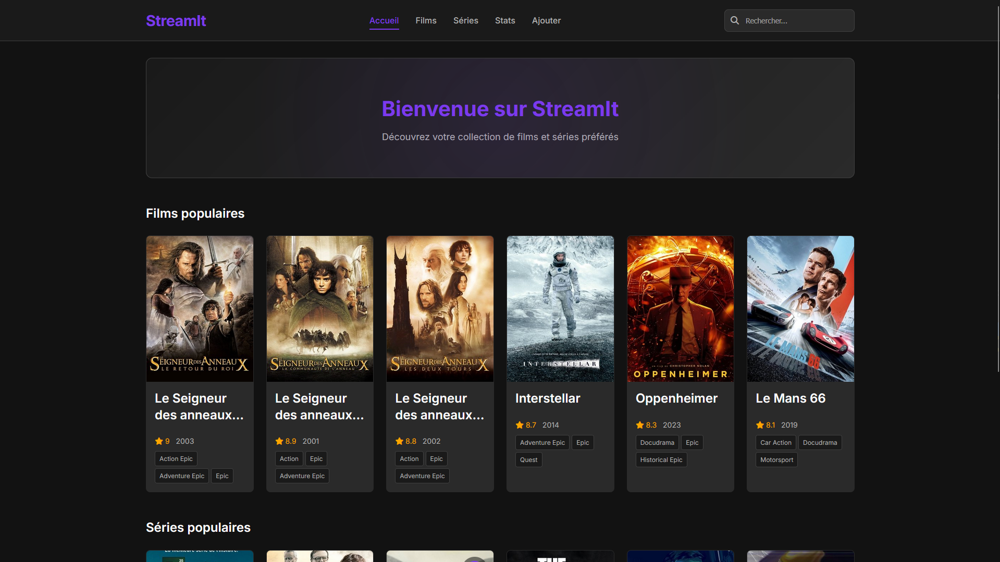
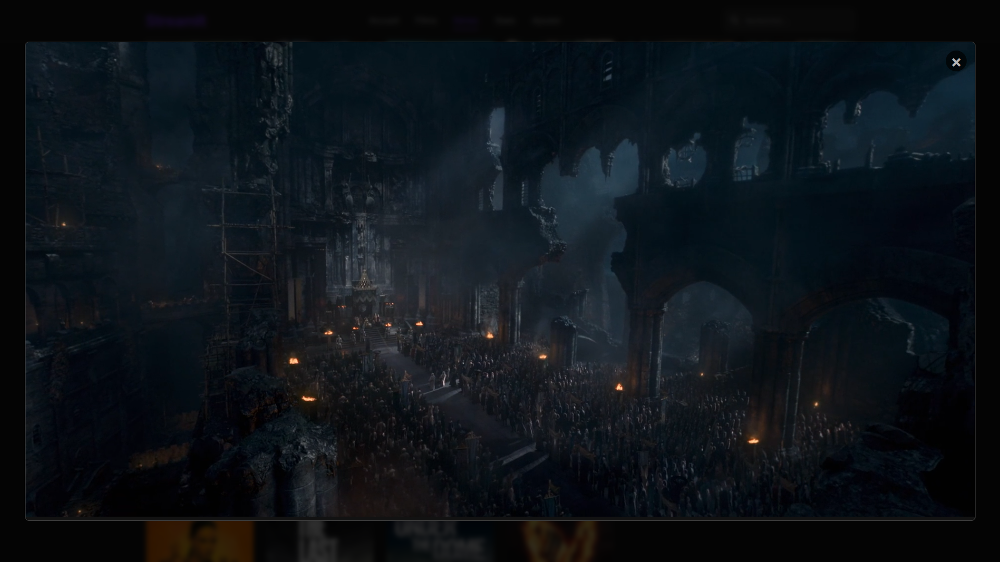
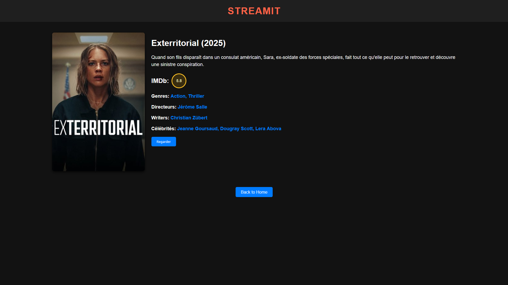
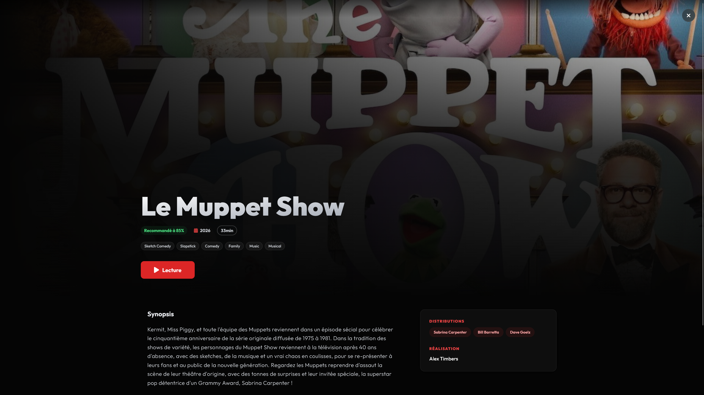
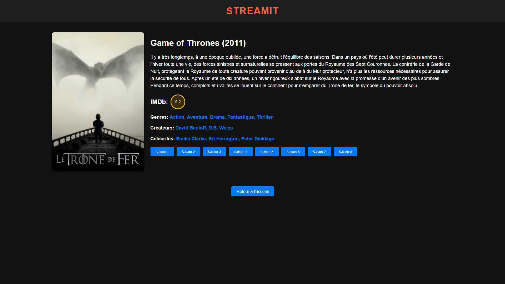
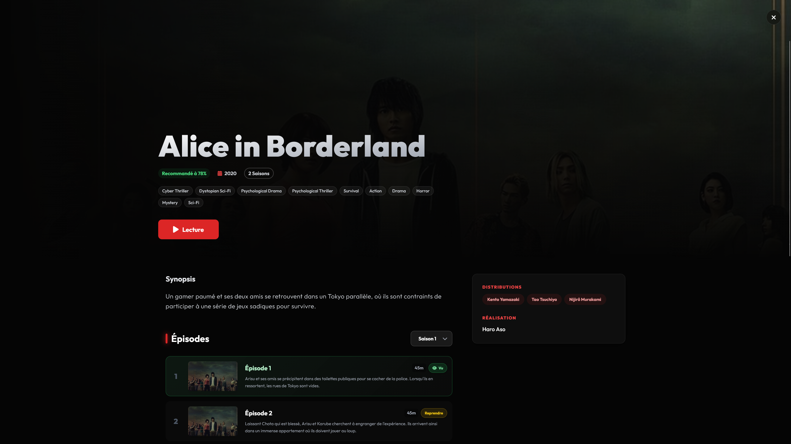

<div align="center">
    
</div>

<h1 align="center">StreamIt</h1>

<div align="center">
    <p>Application web moderne pour organiser, explorer et regarder vos films et séries préférés en toute simplicité.</p>
    
    
    
    
    
</div>

<br>

## Table des matières

- [Comment utiliser StreamIt](#comment-utiliser-streamit)
- [Fonctionnalités](#fonctionnalités)
- [Démo](#démo)
- [Contributeurs](#contributeurs)
- [Problèmes Connue](#problèmes-connus)
- [Structure du projet](#structure-du-projet)

# Comment utiliser StreamIt

Pour commencer avec StreamIt, suivez ces étapes simples:

1. **Cloner le dépôt**

   Téléchargez le projet en clonant le dépôt Git:
   ```bash
   git clone https://github.com/LoupesDEV/StreamIt.git
   ```

2. **Lancer un serveur local**

   Accédez au dossier cloné, puis lancez un serveur local pour servir les fichiers. Par exemple:
    - Avec **VSCode**: faites un clic droit sur `index.html` et sélectionnez **Open with Live Server** (extension
      recommandée).
    - Avec **Python**:
      ```bash
        python3 -m http.server 8000
      ```

> 💡 *Vous pouvez lancer le serveur avec `python3 -m http.server 8000 --bind 0.0.0.0` pour que n'importe qui sur votre réseau Wifi puisse accéder au site. Il vous suffit de récupérer votre IP réseau local (192.168.x.x) avec ifconfig dans un terminal, et de mettre :8000 à la fin !*

3. **Ouvrir l’application dans le navigateur**

   Rendez-vous sur [http://localhost:8000](http://localhost:8000) pour accéder à StreamIt.

> 💡 *Aucune installation supplémentaire n’est requise: StreamIt fonctionne directement dans votre navigateur!*

> *Note bonus* : Tous les films et séries présents sont issus de ma base de données personnelle, mais vous pouvez facilement ajouter vos propres contenus en modifiant les fichiers JSON du dossier `data/`.
> Pour disposer de la même bibliothèque que moi, prévoyez environ 2 To de stockage pour l’ensemble des films et séries.

# Fonctionnalités

- **Bibliothèque unifiée** 🎞️ : fiches riches pour films et séries (titre, synopsis, genres, note, casting, durée, année) avec visuels dédiés.
- **Recherche + filtres** 🔍 : barre instantanée, filtres par genre/année/note et tri pour affiner en temps réel.
- **Lecteur intégré** 🎥 : lecteur moderne, contrôles complets et reprise automatique de la lecture grâce au stockage local.
- **Responsive & navigation** 📱💻🧭 : interface fluide, transitions sans rechargement et mise en page adaptée desktop/tablette/mobile.
- **Performance & accessibilité** ⚡♿ : chargements asynchrones, caching léger, focus visibles et navigation clavier de base.

# Démo

Vous pouvez tester l'application [ici](https://www.matheo-pichotmoise.fr/StreamIt).

<div align="center">
    <table>
        <tr>
            <td></td>
            <td></td>
        </tr>
        <tr>
            <td></td>
            <td></td>
        </tr>
        <tr>
            <td></td>
            <td></td>
        <tr>
    </table>
</div>

# Structure du projet

Le projet est organisé de la manière suivante:

```
StreamIt/
├── index.html                # Page principale l'application
├── error.html                # Page d'erreur (404)
├── css/                      # Dossier contenant les fichiers CSS
├── js/                       # Dossier contenant les fichiers JavaScript
├── medias/                   # Dossier contenant les médias (images, vidéos, etc.)
│   ├── films/                # Dossier pour les images des films
│   ├── series/               # Dossier pour les images des séries
│   ├── README/               # Dossier pour les images du README
│   └── logo.png              # Logo de l'application
├── data/                     # Dossier contenant les données JSON
│   ├── films_data.json       # Données des films
│   ├── series_data.json      # Données des séries
│   ├── notifs.json.          # Données de notifications
│   └── collections.json      # Données des collections
├── README.md                 # Documentation du projet
├── CONTRIBUTING.md           # Guide de contribution
├── CODE_OFCONDUCT.md         # Code de conduite pour les contributeurs
├── jsdoc.json                # Configuration pour JSDoc
├── .gitignore                # Fichier pour ignorer certains fichiers dans Git
└── LICENSE                   # Fichier de licence
```

# Problèmes Connus

- **Accès au média :**
    > Malgrès le blocage du ***DevTools***, n'importe quel utilisateur peut accéder au fichier vidéo et les télécharger relativement facilement. Il leur suffit juste de récupérer l'arborescence ou le chemin d'accès aux médias et en le rajoutant à la fin de l'url *`(/medias/films/avatar/avatar.mp4)`* et il récupère dans ce cas le fichier vidéo du film Avatar.

# Contributeurs

Merci aux personnes et ressources ayant contribué au projet:

- [LoupesDEV](https://github.com/LoupesDEV) — Développement principal, conception et maintenance.
- [GitHub Advanced Security](https://docs.github.com/en/get-started/learning-about-github/about-github-advanced-security) —
  Sécurité et bonnes pratiques.

Vous souhaitez contribuer ? Consultez le [guide de contribution](CONTRIBUTING.md) ou ouvrez une *issue* pour proposer
des améliorations.

<p align="center">
    
    <br><br>
    
</p>
