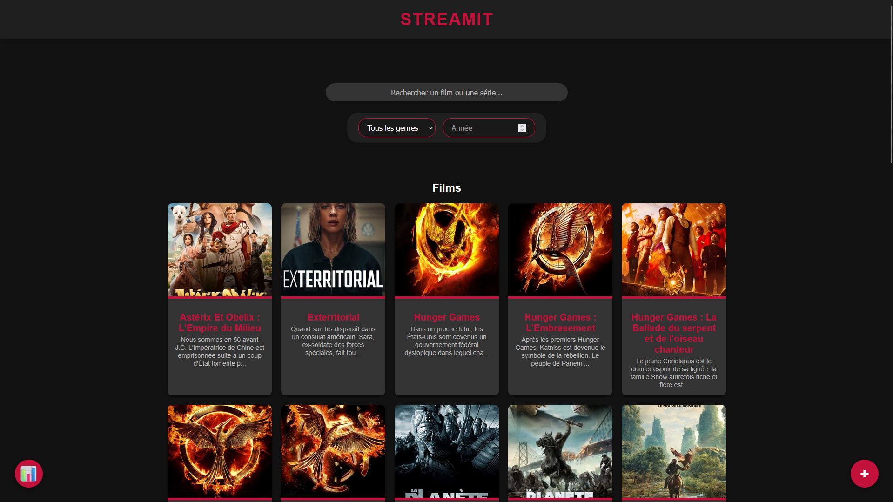
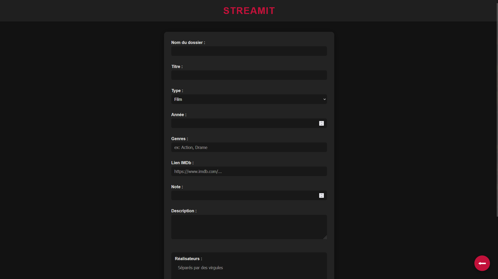

# StreamIt - Application de Streaming Personnel

Bienvenue sur **StreamIt** ! Ce projet vous permet de gérer et de regarder vos séries préférées directement depuis une interface simple et épurée. L'application propose une expérience de streaming fluide avec un accès direct aux épisodes et à leurs informations.

## 🎯 Objectif

Le but de **StreamIt** est de fournir une plateforme personnelle de streaming simple, moderne et accessible pour organiser, explorer et visionner vos contenus préférés.

- Centraliser l’accès à vos **films et séries** dans une interface unique et épurée.
- Offrir une **expérience de visionnage fluide** avec un lecteur intégré.
- Proposer un **affichage dynamique** des données (notes, genres, acteurs, etc.) sans rechargement de page.
- Faciliter la navigation grâce à une **interface responsive** et intuitive, adaptée à tous les écrans.
- Mettre à disposition une **recherche efficace** pour retrouver instantanément vos contenus.

## 🌐 Démo

Vous pouvez tester l'application [ici](https://www.matheo-pichotmoise.fr/StreamIt).

<details>
<summary><strong>Voir les images</strong></summary>

## Page d'accueil



## Page des séries


## Page des films


## Page de stream


## Page d'ajout'


</details>

## 🛠 Technologies Utilisées

Ce projet a été développé avec les technologies suivantes :

- **HTML5 & CSS3** - Structure et mise en page de l'application.
- **JavaScript (ES6+)** - Logique de gestion des séries et des épisodes.
- **JSON** - Stockage et gestion des données des séries.

## 📌 Fonctionnalités

- **Gestion des contenus (films & séries)** 🎞️ : Parcourez vos films et séries préférés avec des fiches détaillées incluant description, genres, note IMDb, créateurs, réalisateurs et acteurs. Pour les séries, naviguez facilement entre les saisons et les épisodes ; pour les films, lancez le visionnage d’un simple clic.
- **Affichage dynamique** 📊 : Les données des films et séries sont chargées dynamiquement, offrant une mise à jour fluide et une interface réactive sans rechargement de page.
- **Visionnage intégré** 🎥 : Regardez vos épisodes ou films directement depuis l’application grâce à un lecteur vidéo embarqué, avec navigation intuitive et retour rapide.
- **Recherche centralisée** 🔍 : Trouvez instantanément un film ou une série via une barre de recherche performante en page d’accueil.
- **Navigation fluide** 🧭 : Interface simple et réactive pour passer facilement d’un contenu à l’autre ou revenir à l’accueil.
- **Design responsive** 📱💻 : Optimisé pour tous les appareils (desktop, tablette et mobile), assurant une expérience de navigation fluide et agréable peu importe la taille de l'écran.
- **Ajout facile de contenus** 📝 : Ajoutez facilement de nouveaux contenus à votre bibliothèque en utilisant les formulaires de saisie dédiés.


## 📂 Structure du projet

Voici la structure des fichiers du projet :

```
StreamIt/
├── css/                      # Différentes feuilles de styles des pages
│   ├── add.css
│   ├── films.css
│   ├── index.css
│   ├── series.css
│   └── watching.css
├── data/                     # Données des films et séries (nom, description, épisodes, etc...)
│   ├── films_data.json
│   └── series_data.json
├── js/
│   ├── add.js
│   ├── films.js
│   ├── index.js
│   ├── series.js
│   └── watching.js
├── medias/                   # Dossier comprenant toutes les médias pour l'application
│   ├── series/               # Dossier pour les différentes séries
│   │   ├── X/
│   │   ├── XX/
│   │   └── XXX/
│   ├── films/                # Dossier pour les différents films
│   │   ├── X/
│   │   ├── XX/
│   │   └── XXX/
│   └── README/               # Dossier d'image pour le README
│   │   ├── add.png
│   │   ├── films.png
│   │   ├── index.png
│   │   ├── series.png
│   │   └── watching.png
│   └── logo.png              # Logo de l'application
├── add.html                  # Ajout de film et série
├── CODE_OF_CONDUCT.md        # Ensemble de règles concernant ce projet
├── CONTRIBUTING.md           # Comment contribuer au projet
├── films.html                # Détails de chaque films
├── index.html                # Page d'accueil
├── LICENSE                   # Licence du projet
├── README.md                 # Documentation du projet
├── series.html               # Détails de chaque série
└── watching.html             # Visionnage des épisodes
```

## 🚀 Installation et Exécution

1. Cloner ce dépôt :

   ```bash
   git clone https://github.com/KucoDEV/StreamIt.git
   ```

2. Ouvrir le dossier cloné et servir les fichiers via un serveur local. Par exemple, utilisez **Live Server** dans VSCode ou Python :

   ```bash
    python3 -m http.server 8000
   ```

3. Accéder à `http://localhost:8000` dans votre navigateur pour commencer à utiliser l'application.

## 📜 Licence

Ce projet est sous licence **GNU General Public License v3.0 (GPL-3.0)**.
Vous êtes libre d'utiliser, modifier et distribuer ce projet tant que vous respectez les termes de la licence.
Cela inclut notamment l'obligation de **rendre publiques les modifications** si vous redistribuez le projet.

Pour plus d'informations, consultez la licence complète ici : [GPL-3.0 License](https://www.gnu.org/licenses/gpl-3.0.html).
