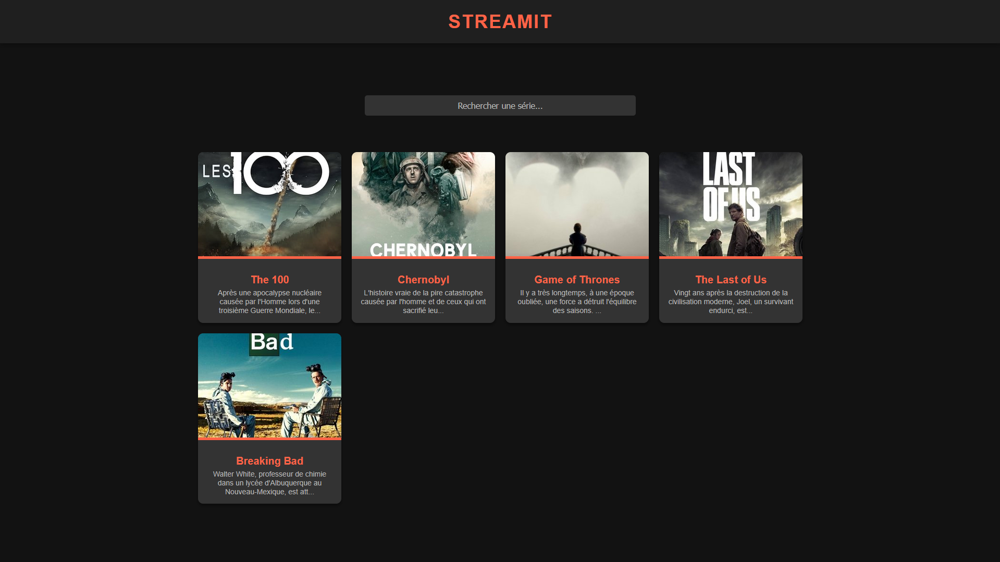
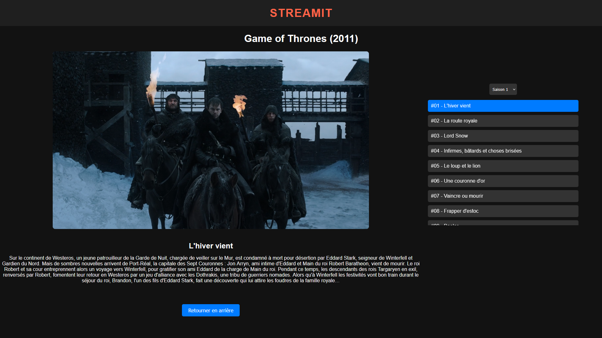

# StreamIt - Application de Streaming Personnel

Bienvenue sur **StreamIt** ! Ce projet vous permet de gérer et de regarder vos séries préférées directement depuis une interface simple et épurée. L'application propose une expérience de streaming fluide avec un accès direct aux épisodes et à leurs informations.

## 🎯 Objectif

Ce projet a pour but de :

- Offrir une plateforme personnelle de streaming pour organiser et visionner vos séries préférées.
- Proposer une navigation simple entre les séries et les épisodes.
- Mettre en avant les informations clés sur chaque série (description, acteurs, genres, note IMDb).
- Fournir une expérience responsive, accessible aussi bien sur mobile que sur desktop.

## 🌐 Démo

Vous pouvez tester l'application [ici](https://www.matheo-pichotmoise.fr/StreamIt).


<details>
<summary><strong>Voir les images</strong></summary>

## Page d'accueil


## Page des séries


## Page de stream

</details>

## 🛠 Technologies Utilisées

Ce projet a été développé avec les technologies suivantes :

- **HTML5 & CSS3** - Structure et mise en page de l'application.
- **JavaScript (ES6+)** - Logique de gestion des séries et des épisodes.
- **JSON** - Stockage et gestion des données des séries.

## 📌 Fonctionnalités

- **Gestion des séries** : Ajoutez et organisez vos séries préférées avec leurs détails.
- **Lecture d'épisodes** : Visionnez directement les épisodes avec un lecteur intégré.
- **Affichage dynamique** des informations sur chaque série : note IMDb, genre, créateurs, acteurs.
- **Navigation fluide** : Accédez facilement aux saisons et aux épisodes.
- **Recherche rapide** : Trouvez vos séries en quelques secondes grâce à une barre de recherche.

## 📂 Structure du projet

Voici la structure des fichiers du projet :

```
StreamIt/
├── media/
│   ├── series/
│   │   ├── X/                # Dossier pour la série X
│   │   ├── XX/               # Dossier pour la série XX
│   │   └── XXX/              # Dossier pour la série XXX
│   └── README/               # Dossier pour le README
│       ├── index.png         # Preview de la page d'accueil
│       ├── series.pong       # Preview de la page des séries
│       └── watching.png      # Preview de la page de visionnage
├── index.html                # Page d'accueil
├── LICENSE                   # Licence du projet
├── README.md                 # Documentation du projet
├── series_data.json          # Données des séries (nom, description, épisodes)
├── series.html               # Détails de chaque série
└── watching.html             # Visionnage des épisodes
````

## 🚀 Installation et Exécution

1. Cloner ce dépôt :
   ```bash
   git clone https://github.com/KucoDEV/StreamIt.git
    ```

2. Ouvrir le dossier cloné et servir les fichiers via un serveur local. Par exemple, utilisez **Live Server** dans VSCode ou Python :
   ```bash
    python3 -m http.server 8080
    ```

3. Accéder à `http://localhost:8080` dans votre navigateur pour commencer à utiliser l'application.

## 📜 Licence

Ce projet est sous licence **GNU General Public License v3.0 (GPL-3.0)**.
Vous êtes libre d'utiliser, modifier et distribuer ce projet tant que vous respectez les termes de la licence.
Cela inclut notamment l'obligation de **rendre publiques les modifications** si vous redistribuez le projet.

Pour plus d'informations, consultez la licence complète ici : [GPL-3.0 License](https://www.gnu.org/licenses/gpl-3.0.html).