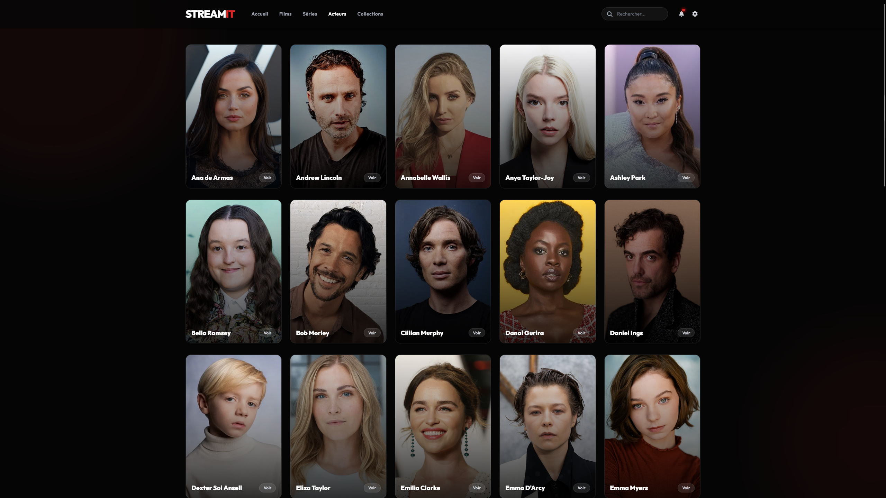
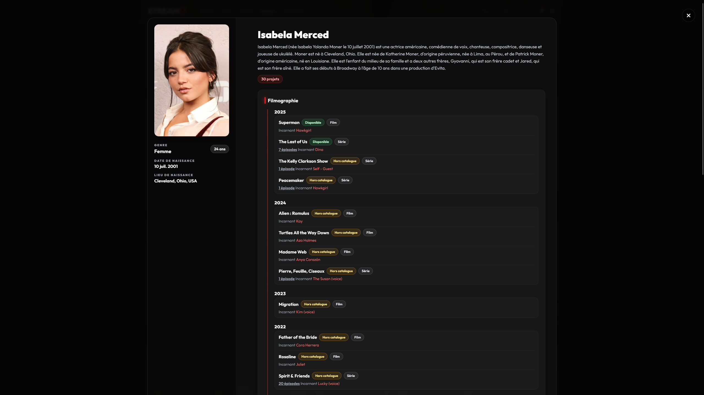

<div align="center">
    
</div>

<h1 align="center">StreamIt</h1>

<div align="center">
    <p>Application web moderne pour organiser, explorer et regarder vos films et séries préférés en toute simplicité.</p>
    
    
    
    
    
</div>

<br>

## Table des matières

- [Technologies utilisées](#technologies-utilisées)
- [Prérequis & Compatibilité](#prérequis--compatibilité)
- [Comment utiliser StreamIt](#comment-utiliser-streamit)
- [Fonctionnalités](#fonctionnalités)
- [Guide d'ajout de contenu](#guide-dajout-de-contenu)
- [Démo](#démo)
- [Structure du projet](#structure-du-projet)
- [Problèmes connus](#problèmes-connus)
- [Roadmap](#roadmap)
- [FAQ](#faq)
- [Contributeurs](#contributeurs)

# Technologies utilisées

StreamIt est construit avec des technologies web modernes pour garantir performance et compatibilité :

- **HTML5** : Structure sémantique et éléments natifs (video, audio)
- **CSS3** : Design moderne avec Glass Morphism, animations et transitions
  - Variables CSS personnalisées pour la cohérence visuelle
  - Responsive design avec media queries
  - Effets de flou avec `backdrop-filter`
- **JavaScript Vanilla (ES6+)** : Logique applicative sans dépendances
  - Modules ES6 pour une architecture modulaire
  - API Web natives (localStorage, Fetch API, Service Worker)
  - Gestion d'événements et DOM manipulation
- **Tailwind CSS** (via CDN) : Framework utilitaire pour le styling rapide
- **Font Awesome 6.4.0** : Bibliothèque d'icônes pour l'interface
- **Google Fonts** : Police Outfit pour une typographie moderne
- **Service Worker** : Support PWA et mise en cache pour mode offline
- **JSON** : Format de stockage des données (films, séries, acteurs)

# Prérequis & Compatibilité

### Navigateurs supportés

StreamIt fonctionne sur les navigateurs modernes supportant ES6+ et les API Web natives :

| Navigateur | Version minimale | Support complet |
|------------|-----------------|------------------|
| Chrome     | 90+             | ✅ Recommandé   |
| Firefox    | 88+             | ✅ Recommandé   |
| Safari     | 14+             | ✅ Recommandé   |
| Edge       | 90+             | ✅ Recommandé   |
| Opera      | 76+             | ✅              |

### Fonctionnalités requises

- **JavaScript ES6+** : Modules, arrow functions, destructuring
- **localStorage** : Sauvegarde de la progression de lecture
- **Service Worker** : Mode offline (optionnel)
- **HTML5 Video** : Lecture de médias avec codecs modernes (H.264, VP9)

### Configuration recommandée

- **Résolution** : 1280×720 minimum (Full HD 1920×1080 recommandé)
- **Connexion** : Recommandée pour le streaming 
- **Espace de stockage** : ~5 Mo pour le cache de l'application
- **Formats vidéo supportés** : MP4 (H.264), WebM (VP9), OGG (Theora)

> ⚠️ **Note** : Les fonctionnalités de reprise de lecture nécessitent que les cookies et le localStorage soient activés.

# Comment utiliser StreamIt

Pour commencer avec StreamIt, suivez ces étapes simples:

1. **Cloner le dépôt**

   Téléchargez le projet en clonant le dépôt Git:
   ```bash
   git clone https://github.com/LoupesDEV/StreamIt.git
   ```

2. **Lancer un serveur local**

   Accédez au dossier cloné, puis lancez un serveur local pour servir les fichiers. Par exemple:
    - Avec **VSCode**: faites un clic droit sur `index.html` et sélectionnez **Open with Live Server** (extension
      recommandée).
    - Avec **Python**:
      ```bash
        python3 -m http.server 8000
      ```

> 💡 *Vous pouvez lancer le serveur avec `python3 -m http.server 8000 --bind 0.0.0.0` pour que n'importe qui sur votre réseau Wifi puisse accéder au site. Il vous suffit de récupérer votre IP réseau local (192.168.x.x) avec ifconfig dans un terminal, et de mettre :8000 à la fin !*

3. **Ouvrir l’application dans le navigateur**

   Rendez-vous sur [http://localhost:8000](http://localhost:8000) pour accéder à StreamIt.

> 💡 *Aucune installation supplémentaire n’est requise: StreamIt fonctionne directement dans votre navigateur!*

> *Note bonus* : Tous les films et séries présents sont issus de ma base de données personnelle, mais vous pouvez facilement ajouter vos propres contenus en modifiant les fichiers JSON du dossier `data/`.
> Pour disposer de la même bibliothèque que moi, prévoyez environ 2.5 To de stockage pour l’ensemble des films et séries.

# Fonctionnalités

### 🎬 Bibliothèque Multimédia Complète
- **Gestion centralisée** : Films, séries, collections et profils d'acteurs avec métadonnées complètes (titre, description, genres, note IMDb, année, durée, casting, réalisateurs/créateurs)
- **Visuels optimisés** : Affiches (posters), bannières (banners) et miniatures pour chaque contenu
- **Collections thématiques** : Regroupement de films par saga ou univers partagé
- **Profils d'acteurs** : Cartes détaillées avec filmographie complète (films et séries)

### 🔍 Recherche & Filtrage Avancés
- **Recherche universelle** : Barre de recherche instantanée (desktop + mobile) avec résultats multi-catégories (films, séries, acteurs)
- **Filtres multiples** : Genre, année de sortie, note IMDb minimale, réalisateur/créateur
- **Tri personnalisable** : Alphabétique (A-Z / Z-A), chronologique (récent / ancien), par note IMDb
- **Compteur de résultats** : Affichage dynamique du nombre de résultats trouvés

### 🎥 Lecteur Vidéo Personnalisé
- **Contrôles complets** : Lecture/pause, avance/recul 10s, vitesse de lecture (0.25x à 2x), plein écran
- **Navigation clavier** : Espace (lecture/pause), flèches (avance/recul), M (muet), F (plein écran)
- **Protection du contenu** : Désactivation du téléchargement, Picture-in-Picture et clic droit
- **Masquage automatique** : Contrôles et curseur disparaissent après 3 secondes d'inactivité pendant la lecture
- **Affichage contextuel** : Titre du film ou informations série (format S1:E1 + titre de l'épisode)

### 💾 Gestion de la Progression
- **Reprise automatique** : Sauvegarde continue de la position de lecture dans le localStorage
- **Marquage intelligent** : Détection automatique du visionnage complet (< 3 min ou 5% de la fin)
- **Badges visuels** : Indicateurs "Vu" (✓) et "Reprendre" sur les vignettes de contenus
- **Export/Import** : Sauvegarde et restauration de la progression au format JSON avec horodatage
- **Suivi par épisode** : Gestion indépendante de la progression pour chaque épisode de série

### 🎨 Interface Moderne & Responsive
- **Design Glass Morphism** : Panneaux translucides avec effets de flou (backdrop-filter) et bordures lumineuses
- **Animations fluides** : Blobs animés en arrière-plan, transitions CSS customisées, effets hover élaborés
- **Section Hero dynamique** : Bannière plein écran avec contenu mis en avant (featured) ou dernier ajout
- **Grilles adaptatives** : 2 colonnes (mobile), 3 (tablette), 4-5 (desktop) avec support du scroll horizontal
- **Navigation mobile** : Menu hamburger avec panneau latéral et barre de recherche dédiée
- **Scrolling optimisé** : Support du défilement horizontal à la molette de souris pour les rangées de contenu

### 🧭 Navigation & Routing
- **Single Page Application** : Router personnalisé sans rechargement de page (JS natif)
- **5 sections principales** : Accueil, Films, Séries, Collections, Acteurs
- **Overlays détaillés** : Panneaux full-screen pour les détails de contenu et profils d'acteurs
- **Navigation fluide** : Transitions animées, scroll automatique vers le haut, synchronisation des états

### 📺 Fonctionnalités Séries
- **Support multi-saisons** : Sélecteur de saisons avec rendering dynamique des épisodes
- **Cartes d'épisodes** : Miniatures, titres, descriptions, durées avec badges de statut (vu/reprendre)
- **Lecture continue** : Enchaînement manuel entre épisodes avec sauvegarde de contexte (série/saison/épisode)
- **Rafraîchissement automatique** : Mise à jour des badges après fermeture du lecteur

### 🔔 Système de Notifications & Paramètres
- **Notifications** : Dropdown animé avec badge de compteur et liste de notifications (JSON)
- **Paramètres** : Menu avec options d'export/import de progression
- **Gestion des états** : Fermeture automatique des menus concurrents

### ⚡ Performance & Optimisation
- **Chargement asynchrone** : Fetch parallèle des fichiers JSON (films, séries, collections, acteurs, notifications)
- **Service Worker** : Mise en cache des ressources statiques pour support PWA offline
- **Écran de chargement** : Animation de chargement avec délai simulé de 800ms pour UX cohérente
- **Gestion d'erreurs** : Page d'erreur dédiée avec handler centralisé et messages contextuels

### ♿ Accessibilité & Expérience Utilisateur
- **Navigation clavier** : Support complet dans le lecteur vidéo
- **Labels sémantiques** : Attributs alt, aria-label et structure HTML5 appropriée
- **Focus visibles** : Indicateurs de focus pour navigation au clavier
- **Fallbacks intelligents** : Images de remplacement (placeholders) et textes par défaut pour données manquantes
- **États de chargement** : Spinners et indicateurs pendant les opérations asynchrones

# Guide d'ajout de contenu

Vous pouvez facilement personnaliser StreamIt en ajoutant vos propres films et séries. Voici comment procéder :

### 📁 Structure des fichiers JSON

#### Films (`data/films.json`)

```json
{
  "avatar": {
    "title": "Avatar",
    "description": "Sur la lune Pandora, un ancien Marine paraplégique...",
    "year": 2009,
    "duration": "2h 42min",
    "IMDb": 7.9,
    "genres": ["Science-Fiction", "Action", "Aventure"],
    "directors": ["James Cameron"],
    "stars": ["Sam Worthington", "Zoe Saldana", "Sigourney Weaver"],
    "poster": "medias/films/avatar/poster.jpg",
    "banner": "medias/films/avatar/banner.jpg",
    "video": "medias/films/avatar/avatar.mp4",
    "type": "film",
    "featured": false
  }
}
```

#### Séries (`data/series.json`)

```json
{
  "breaking-bad": {
    "title": "Breaking Bad",
    "description": "Un professeur de chimie se lance dans la production de méthamphétamine...",
    "year": 2008,
    "IMDb": 9.5,
    "genres": ["Crime", "Drame", "Thriller"],
    "creators": ["Vince Gilligan"],
    "stars": ["Bryan Cranston", "Aaron Paul", "Anna Gunn"],
    "poster": "medias/series/breaking-bad/poster.jpg",
    "banner": "medias/series/breaking-bad/banner.jpg",
    "type": "serie",
    "seasons": {
      "1": [
        {
          "title": "Chute libre",
          "desc": "Walter White découvre qu'il a un cancer...",
          "duration": "58min",
          "video": "medias/series/breaking-bad/s1/ep1.mp4"
        }
      ]
    }
  }
}
```

#### Acteurs (`data/actors.json`)

```json
{
  "leonardo-dicaprio": {
    "name": "Leonardo DiCaprio",
    "photo": "medias/acteurs/leonardo-dicaprio.jpg",
    "bio": "Acteur et producteur américain renommé...",
    "birthdate": "11 novembre 1974",
    "nationality": "Américain",
    "films": ["titanic", "inception", "the-revenant"],
    "series": []
  }
}
```

### 📂 Organisation des médias

Respectez cette structure pour le bon fonctionnement :

```
medias/
├── films/
│   └── nom-du-film/              # Nom en kebab-case
│       ├── poster.jpg            # 400×600px recommandé
│       ├── banner.jpg            # 1920×1080px recommandé
│       └── nom-du-film.mp4       # Fichier vidéo
├── series/
│   └── nom-de-la-serie/
│       ├── poster.jpg
│       ├── banner.jpg
│       └── s1/                   # Dossier par saison
│           ├── ep1.mp4
│           ├── ep2.mp4
│           └── ...
└── acteurs/
    └── nom-acteur.jpg            # 800×800px recommandé
```

### ✅ Bonnes pratiques

- **Noms de fichiers** : Utilisez le kebab-case (ex: `breaking-bad`, `avatar-2`)
- **Clés JSON** : Doivent correspondre aux noms de dossiers dans `medias/`
- **Images** : Format JPEG ou PNG, optimisées pour le web
- **Vidéos** : Format MP4 (H.264) recommandé pour compatibilité maximale
- **Métadonnées** : Renseignez tous les champs pour une expérience optimale

### 🔄 Rechargement

Après modification des fichiers JSON, rafraîchissez simplement le navigateur (F5) pour voir les changements.

# Démo

Vous pouvez tester l'application [ici](https://www.matheo-pichotmoise.fr/StreamIt).

<div align="center">
    <table>
        <tr>
            <td></td>
            <td></td>
        </tr>
        <tr>
            <td></td>
            <td></td>
        </tr>
        <tr>
            <td></td>
            <td></td>
        <tr>
        <tr>
            <td></td>
            <td></td>
        <tr>
    </table>
</div>

# Structure du projet

Le projet est organisé de la manière suivante:

```md
StreamIt/
├── index.html                # Page principale de l'application
├── error.html                # Page d'erreur personnalisée (404)
├── manifest.json             # Manifeste PWA (Progressive Web App)
├── sw.js                     # Service Worker pour le cache et mode offline
├── jsdoc.json                # Configuration JSDoc pour documentation
├── css/                      # Styles de l'application (~50 Ko)
│   ├── style.css             # Styles principaux et composants
│   ├── variables.css         # Variables CSS (couleurs, espacements)
│   ├── responsive.css        # Media queries pour responsive design
│   ├── video-player.css      # Styles du lecteur vidéo personnalisé
│   └── error.css             # Styles de la page d'erreur
├── js/                       # Scripts JavaScript modulaires (~80 Ko)
│   ├── main.js               # Point d'entrée, routing et initialisation
│   ├── dataLoader.js         # Chargement des données JSON
│   ├── display.js            # Rendu des composants UI
│   ├── utils.js              # Utilitaires (lecteur vidéo, localStorage)
│   └── errorHandler.js       # Gestion centralisée des erreurs
├── data/                     # Données de la bibliothèque (format JSON)
│   ├── films.json            # Base de données des films
│   ├── series.json           # Base de données des séries
│   ├── actors.json           # Profils des acteurs
│   ├── collections.json      # Collections de films (sagas, univers)
│   └── notifs.json           # Notifications système
├── medias/                   # Ressources multimédias (images et vidéos)
│   ├── logo.png              # Logo de l'application (192×192)
│   ├── acteurs/              # Photos des acteurs (format: nom-acteur.jpg)
│   ├── films/                # Dossiers par film
│   │   └── [nom-film]/       # Contient poster.jpg, banner.jpg, video.mp4
│   ├── series/               # Dossiers par série
│   │   └── [nom-serie]/      # Contient poster.jpg, banner.jpg, s*/ep*.mp4
│   └── README/               # Images pour la documentation
├── README.md                 # Documentation complète du projet
├── CONTRIBUTING.md           # Guide de contribution pour développeurs
├── CODE_OF_CONDUCT.md        # Code de conduite pour les contributeurs
├── LICENSE                   # Licence GPL v3.0
└── .gitignore                # Fichiers exclus du versioning Git
```

### 📊 Statistiques du projet

- **Code source** : ~3 000 lignes (HTML + CSS + JS)
- **Taille de l'app** : ~150 Ko (sans médias)
- **Fichiers JSON** : Variable selon bibliothèque
- **Médias** : ~2.5 To pour bibliothèque complète (exemple)
- **Performance** : Chargement initial < 1s (sans vidéos)

# Problèmes connus

### 🔓 Sécurité des médias

**Accès direct aux fichiers vidéo**
> Malgré les protections mises en place (désactivation du clic droit, DevTools protégés), les fichiers vidéo restent accessibles directement via leur URL.
> 
> **Exemple** : `https://exemple.com/medias/films/avatar/avatar.mp4`
>
> **Impact** : Les utilisateurs techniques peuvent télécharger les vidéos en accédant directement aux URLs.
>
> **Solutions possibles** :
> - Mise en place d'un backend avec authentification
> - Utilisation de tokens temporaires pour les URLs
> - Streaming HLS/DASH avec chiffrement
> - Hébergement sur plateforme de streaming sécurisée

### 📱 Limitations techniques

- **Formats vidéo** : Certains navigateurs ne supportent pas tous les codecs (vérifier la compatibilité H.264)
- **Autoplay mobile** : Les navigateurs mobiles peuvent bloquer l'autoplay (politique des navigateurs)
- **Taille des vidéos** : Les fichiers volumineux peuvent prendre du temps à charger selon la connexion
- **localStorage** : Limite de stockage (~5-10 Mo) pour la sauvegarde de progression
- **Mode offline** : Nécessite un premier chargement avec connexion pour le cache Service Worker

### 🐛 Problèmes connus en cours

- **Safari iOS** : Certains gestes tactiles peuvent ne pas fonctionner comme prévu sur le lecteur vidéo
- **Plein écran** : Sur certains navigateurs, le plein écran peut ne pas masquer complètement l'UI du navigateur
- **Recherche** : Les caractères spéciaux peuvent affecter les résultats de recherche

> 💡 **Signaler un problème** : Ouvrez une [issue sur GitHub](https://github.com/LoupesDEV/StreamIt/issues) avec une description détaillée.

# Roadmap

### 🎯 Prochaines fonctionnalités

**Version 3.5** (En cours)
- [ ] Mode sombre/clair avec switch
- [ ] Lecture suivante automatique à la fin d'un épisode
- [ ] Listes de lecture personnalisées
- [ ] Partage de progression entre appareils (cloud sync)
- [ ] Sous-titres et pistes audio multiples
- [ ] Recommandations basées sur l'historique

**Version 3.6** (Planifié)
- [ ] Backend Node.js pour sécurisation des médias
- [ ] Système de notation et reviews
- [ ] Reprise de lecture cross-device
- [ ] Mode cinéma (luminosité réduite)
- [ ] Cast vers Chromecast/AirPlay

> 📢 **Suggestions** : Proposez vos idées dans les [discussions GitHub](https://github.com/LoupesDEV/StreamIt/discussions).

# FAQ

### ❓ Questions fréquentes

**Q : Puis-je utiliser StreamIt pour mes propres films et séries ?**  
R : Absolument ! StreamIt est conçu pour être utilisé avec votre propre bibliothèque. Consultez le [Guide d'ajout de contenu](#guide-dajout-de-contenu).

**Q : Mes vidéos ne se lancent pas, que faire ?**  
R : Vérifiez que :
- Les chemins dans les fichiers JSON sont corrects
- Les vidéos sont au format MP4 (H.264)
- Vous utilisez un serveur local (non en file://)
- Votre navigateur supporte le codec vidéo

**Q : La progression de lecture ne se sauvegarde pas**  
R : Assurez-vous que :
- Le localStorage est activé dans votre navigateur
- Les cookies ne sont pas bloqués
- Vous êtes sur le même navigateur/appareil

**Q : Comment ajouter des sous-titres ?**  
R : Actuellement, les sous-titres ne sont pas supportés nativement. Cette fonctionnalité est prévue pour la version 3.5.

**Q : Puis-je déployer StreamIt sur un hébergement web ?**  
R : Oui ! Uploadez simplement tous les fichiers sur votre serveur. Assurez-vous que le serveur supporte les fichiers vidéo volumineux.

**Q : L'application fonctionne-t-elle sans connexion internet ?**  
R : Partiellement. Après le premier chargement, le Service Worker met en cache l'interface. Les vidéos nécessitent qu'elles soient accessibles localement.

**Q : Comment mettre à jour vers une nouvelle version ?**  
R : Remplacez les fichiers HTML, CSS et JS. Conservez vos dossiers `data/` et `medias/` pour garder votre contenu.

**Q : Quelle est l'espace de stockage nécessaire ?**  
R : L'application elle-même pèse ~150 Ko. L'espace requis dépend de votre bibliothèque de vidéos (exemple: 2.5 To pour ~150 films et 50 séries en HD).

**Q : Puis-je contribuer au projet ?**  
R : Avec plaisir ! Consultez le [guide de contribution](CONTRIBUTING.md) pour commencer.

# Contributeurs

Merci aux personnes et ressources ayant contribué au projet:

- [LoupesDEV](https://github.com/LoupesDEV) — Développement principal, conception et maintenance.
- [GitHub Advanced Security](https://docs.github.com/en/get-started/learning-about-github/about-github-advanced-security) —
  Sécurité et bonnes pratiques.

Vous souhaitez contribuer ? Consultez le [guide de contribution](CONTRIBUTING.md) ou ouvrez une *issue* pour proposer
des améliorations.

<p align="center">
    
    <br><br>
    
</p>
